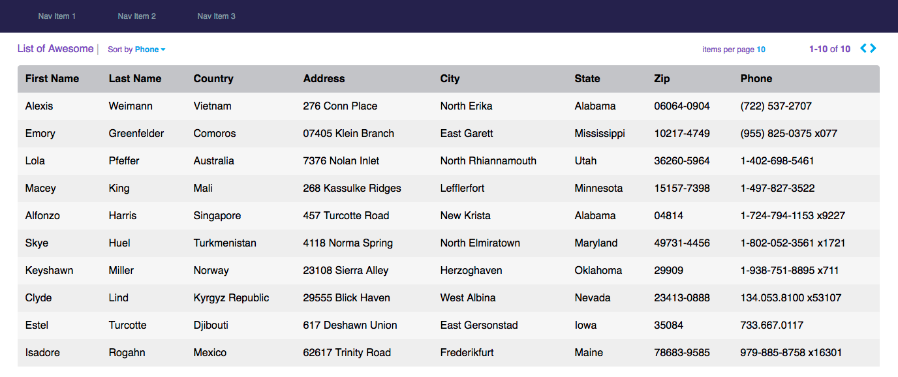

## Users Table made with React

Here is a project I made with React. It is a users table that makes an AJAX API call to a large set of users data. 

I was given the following image and designed my functional table to be an exact replicate.

## Functionality
The table has the following functionality:

* Page Size dropdown: This dropdown will let you select the page size and have values like (5 Items, 10 Items, 25 Items, 50 Items, 75 Items, and 100 Items).
* Next Button: The next button pages forward and loads the next set of rows
* Prev Button: The previous button page pages backward and loads the previous set of rows
* Count: The count should show the current indices and total number of items (eg: 11-20 of 100)
* Sorting: The rows should be sortable by clicking the column header

